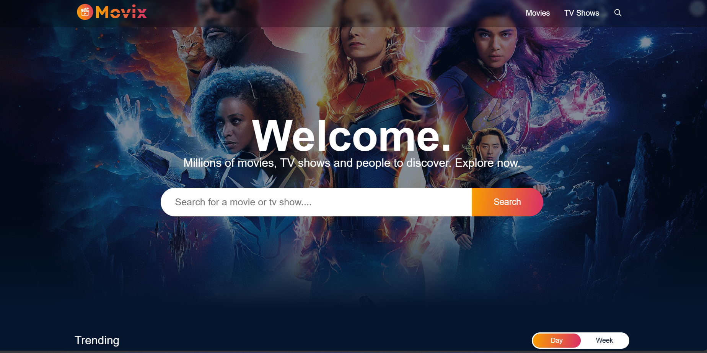
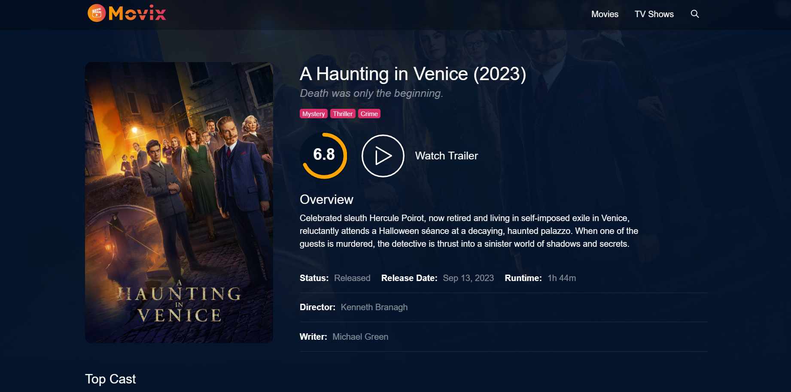
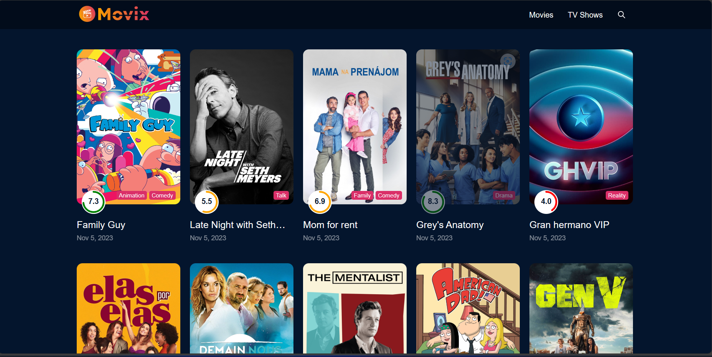

# Movix 

## Overview
Movix is a web application that allows user to manage their favorite movies. With Movix, you can create a personal movie collection, can see the rating of movies and discover new films. It's the ultimate platform for movie enthusiasts!

## Features

- **Movie Catalog**: Browse and search for movies from a vast database.

- **Discover New Movies**: Get movie recommendations based on your preferences.
- **Personalized Dashboard**: View your movie collection, ratings, and reviews.
- **Responsive Design**: Movix is designed to work on both desktop and mobile devices.

## Demo
You can check out a live demo of Movix [here](https://movix-by-anurag.netlify.app/).

# 
# 
# 

## Getting Started
To run Movix locally or deploy it, follow these steps:

1. **Clone the Repository**:

2. **Install Dependencies**:

3. **Set Up Environment Variables**:
Create a `.env` file in the root directory with the following content:

4. **Start the Development Server**:

5. **Access the Application**:
Open your web browser and visit `http://localhost:3000` to access Movix.

## Technologies Used
- React
- React Router
- API (for movie data, e.g., TMDb API)
- CSS (you can specify the CSS framework or libraries used)

## Contributing
We welcome contributions! If you'd like to enhance Movix or fix issues, 

## Contact
If you have any questions or feedback, feel free to reach out to us at thakuranuragsingh099@gmail.com.

---

Thank you for using Movix! We hope you enjoy managing your movie collection and exploring new films with our web application. If you have any questions or need assistance, please don't hesitate to ask.

